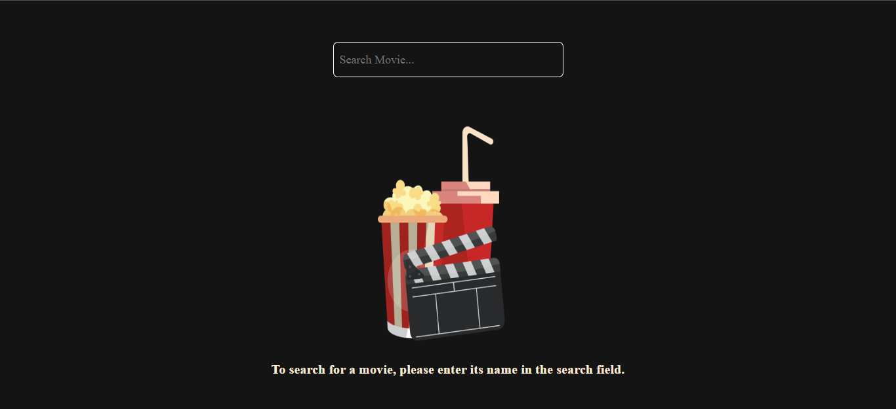
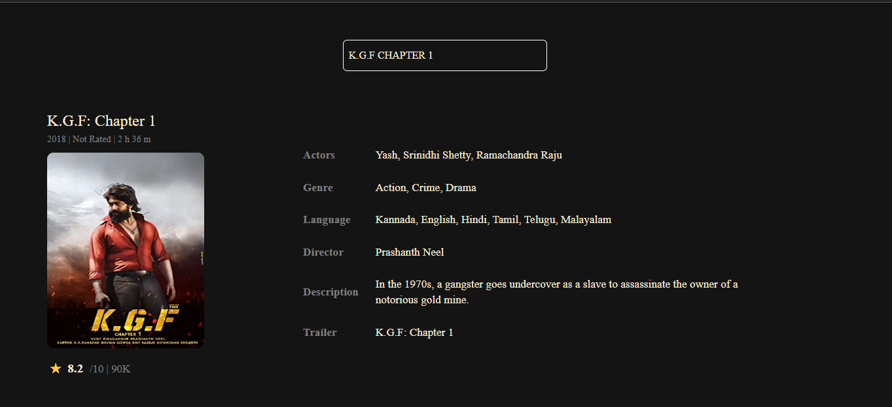

# React Movie Library

## Overview
  - This is a simple movie library.

## Features
  - You can search movie by movie name.
  - You can see your searched movie's,
    - Ratings
    - Time duration
    - Actors
    - Genre
    - Language
    - Director
    - Description
    - Trailer
    - Released year 

## Technologies Used
  - ReactJS - JavaScript library for building user interfaces
  - Material ui - For designing
  - OMDb API - For movie database

## Getting Started
  - Clone the repository: <code>git@github.com:systemintegration/react-movie-library.git</code>
  - Install dependencies: <code>npm install</code>
  - Start the development server: <code>npm start</code>

## Contributing
  - Contributions are welcome! To contribute to the project, follow these steps:
    - Fork the repository
    - Create a new branch: <code>git checkout -b my-feature-branch</code>
    - Make your changes and commit them: <code>git commit -am 'Add some feature'</code>
    - Push your changes to your branch: <code>git push origin my-feature-branch</code>
    - Create a new pull request and explain your changes
In the project directory, you can run:

## Screenshots
  - First page when you run the project.
   

  - When You search movie.
   

## Demo
   - You can try out the application at <a href="https://systemintegration.github.io/react-movie-library/">https://systemintegration.github.io/react-movie-library/</a>
